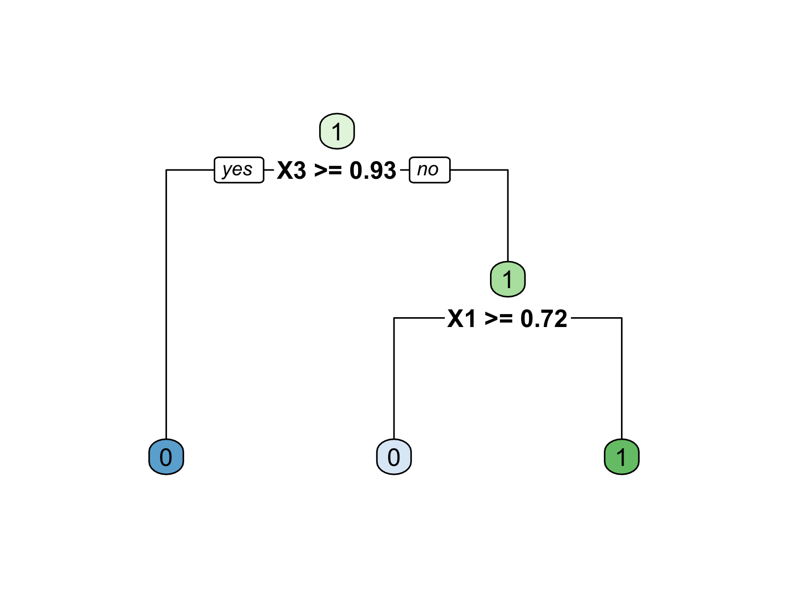
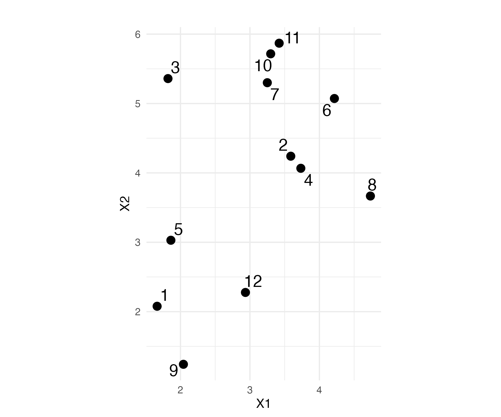
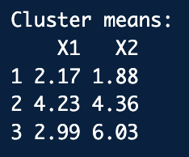

# Plan for today:

- Practice questions

- Q&A

__A quick note:__ These practice questions cover a selection of topics to help you revise. They are not a comprehensive review of the course, so please don't read too much into which topics are or aren't included here. For a fuller picture of what to study, please consult the study guides available on GitHub.

## Question 1: Probability

Let's suppose we have a fair (evenly-weighted) twenty-sided die. For any given roll of this die we can talk about each outcome as an 'event' in the 'sample space' (set of all possible outcomes). In this case, the sample space is the set of integers from 1 through 20. We could denote that as $\Omega = \{1,2,3,4,5,6,7,8,9,10,11,12,13,14,15,16,17,18,19,20\}$.

Note that we can reason both about individual events in the sample space (e.g. rolling a $1$ or a $5$), or about combinations of those individual events (e.g. rolling less than $6$, or rolling an even number). This latter case, which is called the union of events, is governed by the third axiom of probability (additivity). We can simply add up the probabilities of the underlying events to calculate the probability of the combination. 

#### 1a)

What is the probability of rolling a 10 on a single roll of this die? 

_Answer: Probability is defined in terms of the chance of an event happening. In this case we know the sample space (given above), and that each event is equally likely. Given that there are 20 possible events, the chance of any one happening is 1 in 20, or 1/20, or 0.05._

#### 1b)

What is the probability of rolling a 10 or less on a single roll of this die?

_Answer: This asks for the probability of the union ($\cup$) of each event 1 through 10. We know that each of the events 1:10 is equally likely, at 1/20. Using additivity we can simply add these up to learn that rolling 10 or less has a probability of 10/20, or 0.5_

#### 1c)

Imagine we roll the die twice in sequence (so each roll is independent). What is the probability of the first roll being a 20 and the second roll being a 1? (Note this is called a 'joint probability' and could be formally written as $P(roll1=20 \cap roll2=1)$.)

_Answer: This question is asking for the intersection ($\cap$). Since the rolls are independent, we can simply multiply the probabilities of each event together to find probability of the events happening together. We know that the probability of rolling a 20 is 1/20, and the probability of rolling a 1 is also 1/20. Therefore, the joint probability is (1/20) * (1/20) = 1/400, or 0.0025._

## Question 2: Statistics and Regression

In this question, we'll work with the mathematics student performance data that we used in Core ML 1 & 2. The dataset is structured as follows:

__Dependent Variable__

- G3: Final 3rd-year grade (numeric: from 0 to 20)

__Explanatory Variables__

- G1: 1st-year grade (numeric: from 0 to 20)
- address: Student's home address type (binary: 'R' - rural or 'U' - urban)
- absences: Number of school absences (numeric: from 0 to 93)
- Walc: Weekend alcohol consumption (numeric: from 1 - very low to 5 - very high)
- internet: Internet access at home (categorical: no or yes)
- studytime: Weekly study time (numeric: 1 - 10 hours)
- traveltime: home to school travel time (numeric: 1 - 4 hours)

We fit the following multiple linear regression model:

$$
\begin{aligned}
\hat{G}_{3,i} &= \hat{\beta}_0 \\
&\quad + \hat{\beta}_1\,(\text{address}_i) \\
&\quad + \hat{\beta}_2\,(\text{G1}_i) \\
&\quad + \hat{\beta}_3\,(\text{absences}_i) \\
&\quad + \hat{\beta}_4\,(\text{Walc}_i) \\
&\quad + \hat{\beta}_5\,(\text{internet}_i) \\
&\quad + \hat{\beta}_6\,(\text{studytime}_i) \\
&\quad + \hat{\beta}_7\,(\text{traveltime}_i) \\
&\quad + \hat{\varepsilon}_i
\end{aligned}
$$

and get the resulting output:

| Predictor | Estimate | Std. Error | t stat | P-value |
|:---------------|----------:|-----------:|--------:|:------------|
| (Intercept) | -2.24759 | 0.84820 | -2.650 | 0.00838 ** |
| addressurban | 0.42680 | 0.35529 | 1.201 | 0.23037 |
| G1 | 1.11023 | 0.04191 | 26.489 | < 2e-16 *** |
| absences | 0.02848 | 0.01734 | 1.643 | 0.10127 |
| Walc | 0.16278 | 0.11199 | 1.454 | 0.14686 |
| internetyes | 0.29336 | 0.36932 | 0.794 | 0.42748 |
| studytime | -0.11323 | 0.17111 | -0.662 | 0.50850 |
| traveltime | -0.22720 | 0.20949 | -1.085 | 0.27878 |

Multiple R-squared:  0.6545,	Adjusted R-squared:  0.6483 

| Variable      | 2.5 %       | 97.5 %     |
|---------------|-------------|------------|
| (Intercept)   | -3.9152     | -0.5800    |
| addressurban  | -0.2717     | 1.1253     |
| G1            | 1.0278      | 1.1926     |
| absences      | -0.0056     | 0.0626     |
| Walc          | -0.0574     | 0.3830     |
| internetyes   | -0.4327     | 1.0195     |
| studytime     | -0.4496     | 0.2232     |
| traveltime    | -0.6391     | 0.1847     |

#### 2a)

Interpret the coefficient for $G1$, including magnitude, direction, and statistical significance. 

_Answer: Controlling for all other variables, a one grade point increase in first year grade is associated with an expected increase in third-year grade by 1.11023 points. This is significant at all conventional levels of statistical significance._

#### 2b)

Interpret the $R^2$ value. 

_Answer: The regression model with the aforementioned variables accounts for 65.45% of the total variance in our outcome. The remaining 34.55% is unexplained by the model and attributed to residuals (consisting of random error, unmeasured variables, & noise)._

#### 2c)

How do you interpret the coefficient for the intercept? Is this meaningful in our context?

_Answer: G3 will be -2.25 when all explanatory variables equal 0. This is not meaningfully interpretable because it is not possible to have a negative grade._

#### 2d)

Interpret the coefficient for $addressurban$, including magnitude, direction, and statistical significance. 

_Answer: Controlling for all other variables, those living in urban areas have an average expected third-year grade that is 0.42680 higher than those in rural areas. The p-value is greater than 0.05, and thus this is not statistically significant at any conventional social science level of significance. We fail to reject the null, and can conclude that there is no difference in expected third-year grade between those living in rural and urban areas._

#### 2e) 

Interpret the confidence intervals for $traveltime$. What can we say about statistical significance by looking at the confidence intervals __only__.

_Answer: Controlling for all other variables, we can be 95% confident that the population parameter for traveltime lies between -0.6391 and 0.1847. 0 is contained within these intervals, and is thus a plausible value for the population parameter. As a result, we fail to reject the null hypothesis at the 5% significance level._

## Question 3: Causal Inference

The table below presents a hypothetical study involving twelve units. Potential outcomes are given as $Y_1$ and $Y_0$ for treatment $D$, where 1 represents treatment and 0 control. $X$ is a binary pre-treatment covariate that can take the value of 0 or 1. 

| Unit | $Y_0$ | $Y_1$ | $D$ | $X$ | $Y$ |
|------|-------|-------|-----|-----|-----|
| 1    | 28    | 28    | 0   | 0   |     |
| 2    | 16    | 20    | 0   | 0   |     |
| 3    | 26    | 26    | 1   | 0   |     |
| 4    | 22    | 26    | 1   | 0   |     |
| 5    | 5     | 5     | 1   | 0   |     |
| 6    | 12    | 10    | 0   | 1   |     |
| 7    | 25    | 29    | 0   | 1   |     |
| 8    | 19    | 24    | 1   | 1   |     |
| 9    | 25    | 30    | 1   | 1   |     |
| 10   | 16    | 21    | 0   | 1   |     |
| 11   | 26    | 30    | 1   | 1   |     |
| 12   | 14    | 17    | 1   | 1   |     |

#### 3a)

Fill in the _observed_ values of $Y$ for each observation.

#### 3b)

Calculate the __true__ average treatment effect (ATE). Be sure to show your working.

_Answer: (0+4+0+4+0+(−2)+4+5+5+5+4+3)/12 = 2.67_

#### 3c)

How many of the 24 potential outcomes in the table will be observed?

_Answer: 12 of the 24 potential outcomes will be observed._

#### 3d)

Calculate the __estimated__ ATE using only the observed outcomes. Be sure to show your working. 

_Answer: ((26+26+5+24+30+30+17)/7) - ((28+16+12+25+16)/5) = 22.57 - 19.4 = 3.17_

#### 3e)

Calculate the average values of $Y_0$ separately among the treated units and among the control units in this study, and also calculate the average values of $Y_1$ separately among the treated and control units.

_Answer:_

- Where $D = 1$: 
    - $Y_0$: (26+22+5+19+25+26+14)/7 = 19.57
    - $Y_1$: (26+26+5+24+30+30+17)/7 = 22.57

- Where $D = 0$:
    - $Y_0$: (28+16+12+25+16)/5 = 19.4
    - $Y_1$: (28+20+10+29+21)/5 = 21.6

#### 3f)

Using the values in the table, calculate the __true__ conditional average treatment effect (CATE) when $X = 0$.

_Answer: (0+4+0+4+0)/5 = 1.6_

#### 3g)

Using the values in the table, calculate the __true__ CATE when $X = 1$.

_Answer: (-2+4+5+5+5+4+3)/7 = 3.43_

#### 3h)

Considering your answers to 3f and 3g, what might you conclude about the role of $X$ in this study?

_Answer: The ATE is not constant across both levels of $X$. There appears to be treatment effect heterogeneity, as the true ATE is higher for those units where $X = 1$. $X$ is a moderator of treatment effect._

#### 3i)

Using the values in the table, calculate the __estimated__ CATE for __both__ $X = 1$ and $X = 0$.

_Answer:_

- Where $X = 0$:
    - ((26+26+5)/3) - ((28+16)/2) = 19 - 22 = -3
- Where $X = 1$:
    - ((24+30+30+17)/4) - ((12+25+16)/3) = 25.25 - 17.67 = 7.58

#### 3j)

Suppose there was a large difference between the estimated ATE and the true ATE. What might drive such a deviation? What do we call it when the difference between the estimated ATE and the true ATE goes to zero over repeated samples?

_Answer: A confounder or sampling error could drive this difference. We would call it 'unbiased' when the difference between the estimated and true ATE goes to zero over repeated samples._

## Question 4: Supervised Machine Learning

Below is a table containing class labels for a binary categorical variable, $Y$, and information on three predictors - $X1$, $X2$, and $X3$. $\hat{p}_{\mathrm{logit}}$ represents the predicted probabilities from a logistic regression model that was trained to predict $Y$ with our three predictors. $\hat{Y}_{\mathrm{tree}}$ contains the predicted classes from a decision tree on the same task. 

| $Y$ | $X1$       | $X2$       | $X3$       | $\hat{p}_{\mathrm{logit}}$ | $\hat{Y}_{\mathrm{tree}}$ |
|---|----------|----------|----------|----------------------------|---------------------------|
| 0 | 0.937075 | 0.719112 | 0.138710 | 0.438747                   | 0                         |
| 0 | 0.286140 | 0.934672 | 0.988892 | 0.467486                   | 0                         |
| 0 | 0.830448 | 0.255429 | 0.946668 | 0.715913                   | 0                         |
| 1 | 0.519096 | 0.940015 | 0.514212 | 0.440106                   | 1                         |
| 0 | 0.736588 | 0.978226 | 0.390203 | 0.239072                   | 0                         |
| 1 | 0.134667 | 0.117487 | 0.905738 | 0.992029                   | 1                         |
| 1 | 0.656992 | 0.474997 | 0.446970 | 0.833798                   | 1                         |
| 1 | 0.705065 | 0.560333 | 0.836004 | 0.544788                   |                           |
| 1 | 0.914806 | 0.457742 | 0.904031 | 0.405050                   |                           |
| 1 | 0.641746 | 0.462293 | 0.082438 | 0.923012                   |                           |

#### 4a)

Is this data labelled or unlabelled? 

_Answer: The data is labelled as we observe all observed values of $Y$._

#### 4b)

Below is an image of the decision tree that was used to predict classes. Fill in the remaining 3 predicted classes according to the model structure. 

_Answer: 1, 0, 1_

#### 4c)

Calculate a confusion matrix for both the logistic regression and decision tree models. Utilise a 0.5 decision boundary where appropriate. 

_Answer:_

**Confusion Matrix: Logistic Regression**

|               | Predicted: 0 | Predicted: 1 |
|---------------|--------------|--------------|
| **Actual: 0** |    3 (TN)    |     1 (FP)   |
| **Actual: 1** |    2 (FN)    |     4 (TP)   |

**Confusion Matrix: Decision Tree**

|               | Predicted: 0 | Predicted: 1 |
|---------------|--------------|--------------|
| **Actual: 0** |    4 (TN)    |    0 (FP)    |
| **Actual: 1** |    1 (FN)    |    5 (TP)    |

#### 4d)

Why might a 0.5 decision boundary be a non-optimal assumption?

_Answer: You may be able to yield better discriminatory capacity from a different decision boundary_

#### 4e)

Using your confusion matrices, please calculate the (1) accuracy, (2) precision, and (3) recall of both the logistic regression and decision tree models for the __positive class.__

_Answer:_

- Logistic Regression
    - Accuracy = (4 + 3) / 10 = 0.70
    - Precision = 4 / (4 + 1) = 0.80
    - Recall = 4 / (4 + 2) = 0.67

- Decision Tree
    - Accuracy = (5 + 4) / 10 = 0.90
    - Precision = 5 / (5 + 0) = 1.00
    - Recall = 5 / (5 + 1) = 0.83

#### 4f)

Below is a test set that was also used to evaluate the decision tree’s model performance. This yielded the confusion matrix that follows. Our evaluation metric calculations have also changed. How have they changed, and what do you think is the likely reason for this?

| $Y$ | $X_1$     | $X_2$     | $X_3$     | $\hat{Y}_{\mathrm{tree}}$ |
|-----|-----------|-----------|-----------|---------------------------|
| 1   | 0.2875775 | 0.5514350 | 0.24608773 | 1                        |
| 0   | 0.7883051 | 0.4566147 | 0.04205953 | 0                        |
| 0   | 0.4089769 | 0.9568333 | 0.32792072 | 1                        |
| 1   | 0.8830174 | 0.4533342 | 0.95450365 | 0                        |
| 1   | 0.9404673 | 0.6775706 | 0.88953932 | 0                        |
| 0   | 0.0455565 | 0.5726334 | 0.69280341 | 1                        |
| 1   | 0.5281055 | 0.1029247 | 0.64050681 | 1                        |
| 1   | 0.8924190 | 0.8998250 | 0.99426978 | 0                        |

**Decision Tree Confusion Matrix for Test Set**

|               | Predicted: 0 | Predicted: 1 |
|---------------|--------------|--------------|
| **Actual: 0** |    1 (TN)    |    2 (FP)    |
| **Actual: 1** |    3 (FN)    |    2 (TP)    |

- Accuracy = 0.375
- Precision = 0.50
- Recall = 0.40

_Answer: The model performs much worse out-of-sample, and this is likely a product of overfitting to the training data. Alternatively, the test set could be sampled from a different data manifold, so the model will do worse._

#### 4g)

Why might you want to use a random forest instead of a decision tree?

_Answer: We reduce the risk of overfitting by (1) aggregating over many trees, (2) bagging, which is training each tree on its own bootstrapped sample, and (3) random feature selection._

## Question 5: Unsupervised Machine Learning

For this question, we're going to look at clustering. Below is a scatterplot of 12 observations with two variables, $X1$ and $X2$. Suppose you have run a k-means clustering algorithm on this data. The information on the centroids for the resulting clusters can be found in the table below the scatterplot.

#### 5a)

How many clusters have you calculated?

_Answer: 3_

#### 5b)

Plot the centroids of the clusters on the scatter plot. Mark the spots with an 'X.'

#### 5c)

Draw a polygon around the observations in each cluster. 

#### 5d)

Which observations belong to which clusters?

_Answer:_

- Cluster A
    - 1, 5, 9, 12
- Cluster B
    - 2, 4, 6, 8
- Cluster C 
    - 3, 7, 10, 11

## Question 6: Text as Data

In this question, we provide a short text extract below. All analysis will be in reference to this extract. The text contains three sentences, and each sentence should be considered a row in a document-feature matrix. 

__Sir Keir Starmer, the Prime Minister of the United Kingdom, addressed Parliament on Wednesday. He discussed the potentially transformative effects of widespread AI adoption. The PM will be following Wednesday's briefing with a whistlestop tour around the industrial heartlands of the UK.__

#### 6a) 

Name and describe two ways of performing document selection for this text, and explain what a 'document' is in the context of quantitative text analysis. 

_Answer: Metadata-based selection or Keyword/dictionary-based selection. A document is the basic unit of analysis (row) in QTA._

#### 6b) 

If the string “Sir Keir Starmer” were saved in a plain text file encoded with UTF-8, how big would the file be? If it were encoded with UTF-16, how big would the file be? _Hint: all the characters here are in the original ASCII character set, and assume your computer does not add any metadata to the plain text file you are saving._

_Answer: For UTF-8: multiply the number of characters by 1 byte (or 8 bits); For UTF-16: multiply the number of characters by 2 bytes (or 16 bits). So here: UTF-8: 16 bytes/128 bits; UTF-16: 32 bytes/256 bits._
 

#### 6c)

Eliminate all the stopwords in the sentences, and write the resulting sentences below.

_Answer_

- Sir Keir Starmer, Prime Minister United Kingdom addressed Parliament Wednesday.
- discussed potentially transformative effects widespread AI adoption
- PM (will) following Wednesday's briefing whistlestop tour around industrial heartlands UK.

#### 6d)

Describe any additional data cleaning required prior to tokenising the text.

_Answer_

- Case-folding
- Punctuation removal
- Named entity recognition
- Stemming/lemmatization if necessary

#### 6e)

Now, tokenise your sentences. Draw a box around each token. Explain whether you are using unigrams, bigrams, or a mix of both. Justify your reasoning. 

_Answer: Mix of uni and bigrams_

- Sir, Keir Starmer, Prime Minister, United Kingdom, address, Parliament, Wednesday
- discuss, potential, transform, effect, widespread, AI, adopt
- PM, will, follow, Wednesday, briefing, whistlestop, tour, around industrial, heartland, UK

#### 6f)

How many tokens are in the document? How many types are in the vocab?

_Answer: 24 tokens and 23 types_

#### 6g)

Create a document-feature matrix by hand and fill in the values.

## Question 7: Audio as Data

To get a continuous sound wave into a computer, we __sample__ it (measure its amplitude at evenly spaced moments in time) and __quantise__ those measurements (round each one to one of a fixed number of levels). Two settings control this: the __sampling frequency__ (samples per second, in Hz) and the __bit depth__ (the number of bits used to store each sample).

#### 7a)

A recording uses a bit depth of 3 bits. How many distinct amplitude levels can each sample take? Show your working.

_Answer: With $n$ bits we can represent $2^n$ patterns, so a 3-bit sample can take $2^3 = 8$ distinct amplitude levels._

#### 7b)

You record 5 seconds of mono (single-channel) audio at a sampling frequency of 8,000 Hz and a bit depth of 8 bits. How many bytes of storage does the raw recording take up? Show your working. _Hint: 8 bits = 1 byte, and assume no metadata or compression._

_Answer: Total bits = sampling frequency $\times$ bit depth $\times$ duration = $8{,}000 \times 8 \times 5 = 320{,}000$ bits. Dividing by 8 bits per byte gives $320{,}000 / 8 = 40{,}000$ bytes._

#### 7c)

Your recording is too large. Name one setting you could lower to shrink the file, and state what you sacrifice by doing so.

_Answer: Either setting works. Lowering the sampling frequency shrinks the file but loses higher-frequency (higher-pitched) detail, because fast variations fall between samples. Lowering the bit depth shrinks the file but quantises amplitude more coarsely, so loudness is captured less faithfully. Both reduce quality; sampling always causes some information loss._
